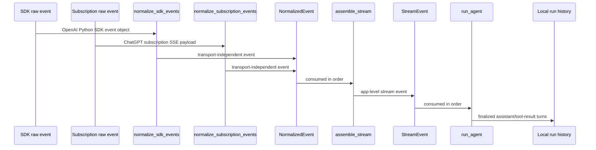
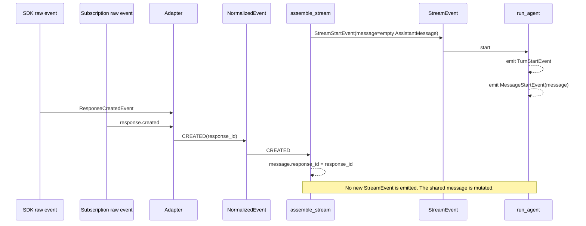
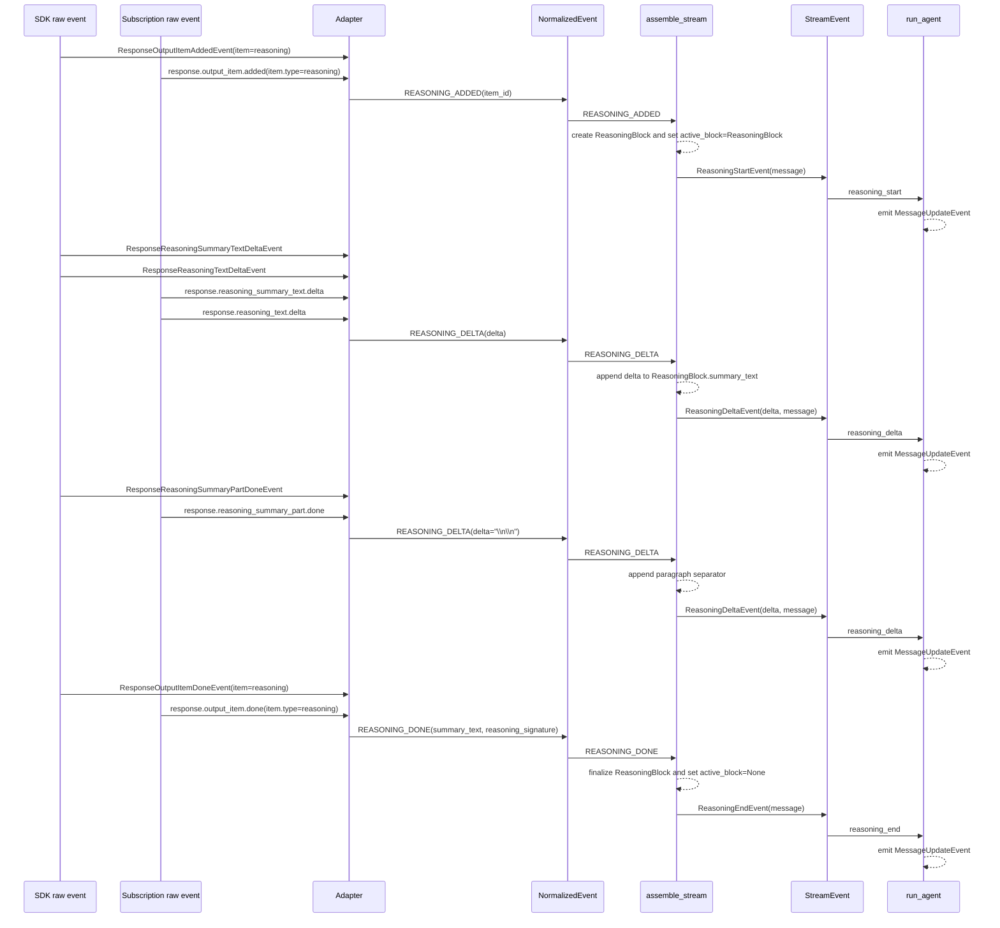
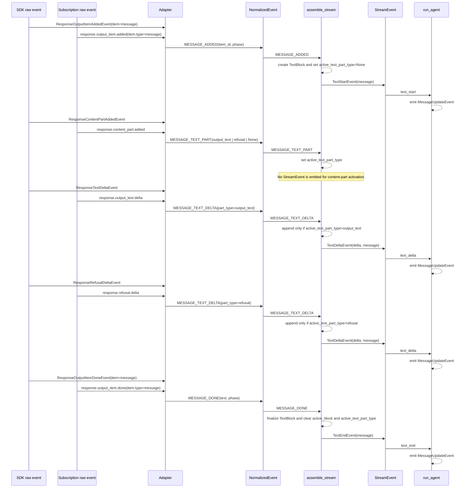
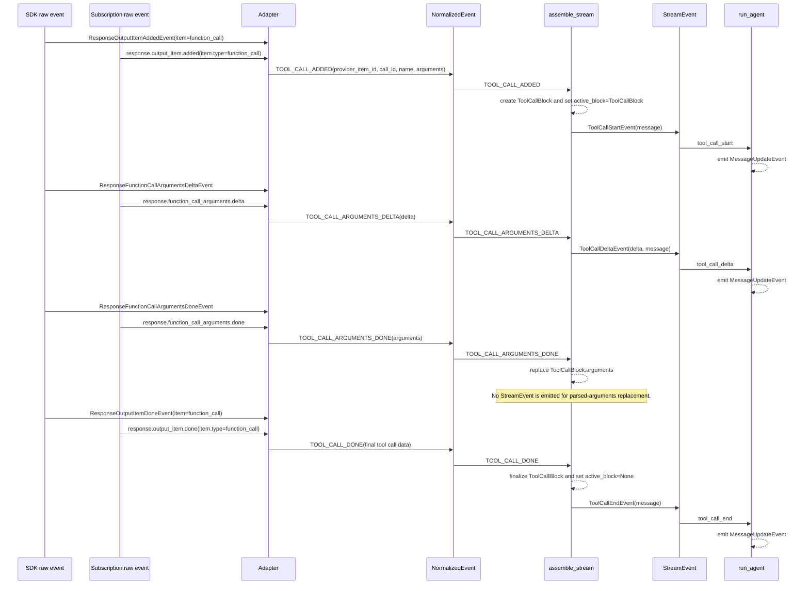
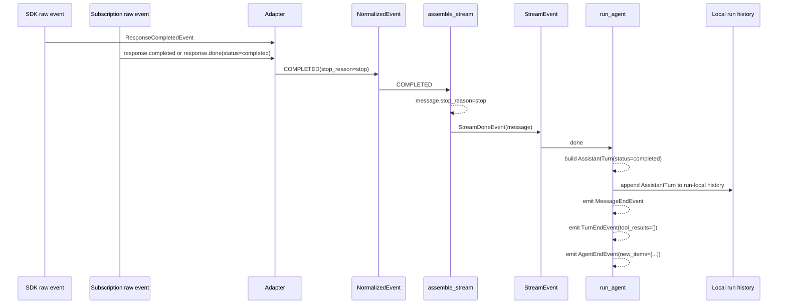
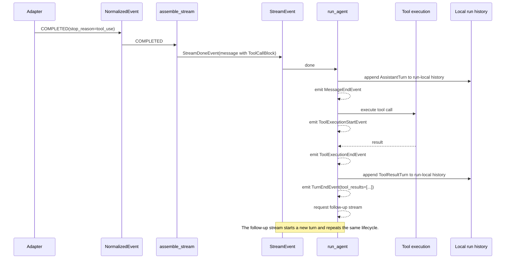
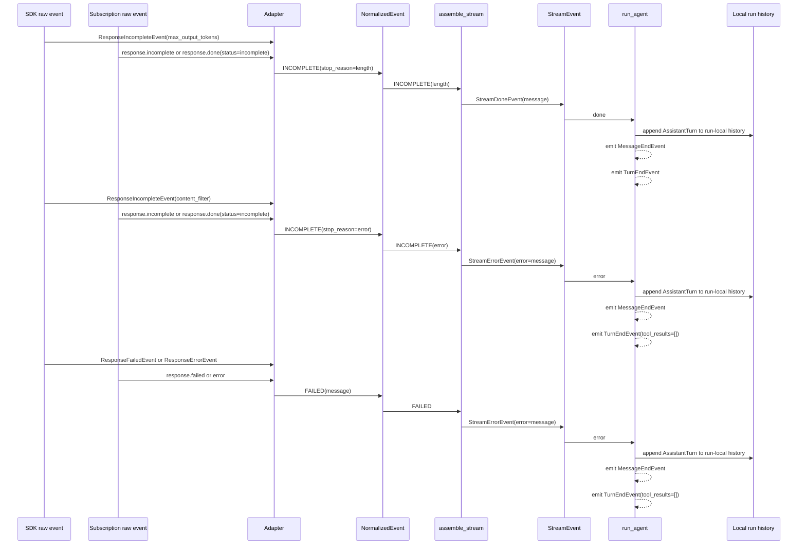

# OpenAI Stream Event Lifecycle

This document maps raw OpenAI stream events from both supported transports to the final agent-facing events. The executable source of truth is still the test suite:

- `tests/test_openai_provider.py` covers raw SDK and subscription payloads through provider stream events.
- `tests/test_openai_stream_assembler.py` covers normalized events through app stream events.
- `tests/test_agent.py` covers app stream events through agent events.

The diagrams below use actor-style Mermaid sequence diagrams. Columns are stages in the pipeline, and time flows from top to bottom.

## Actors

## Stream Start And Created

`assemble_stream` emits a start event before it consumes provider events. The later `CREATED` event mutates the same shared assistant message with the provider response id.

## Reasoning Item

Reasoning summary deltas and reasoning text deltas both normalize to `REASONING_DELTA`. A reasoning summary part completion becomes a paragraph-separator reasoning delta.

## Text And Refusal Item

`MESSAGE_TEXT_PART` selects which text channel is active. Output-text deltas are ignored while refusal is active, refusal deltas are ignored while output text is active, and unsupported parts set the active part to `None`.

## Tool Call Item

Argument deltas are emitted for streaming UI updates. Parsed arguments are stored on the tool-call block when the arguments-done or item-done events arrive.

## Completed Turn Without Tools

## Completed Turn With Tools

## Incomplete And Failed Turns

## Raw Event Mapping

| Raw SDK event | Raw subscription event | Normalized event | Stream assembler effect | Agent effect |
| --- | --- | --- | --- | --- |
| `ResponseCreatedEvent` | `response.created` | `CREATED` | Mutates `message.response_id`; no new stream event | Shared message already referenced by `MessageStartEvent` |
| `ResponseOutputItemAddedEvent` with reasoning item | `response.output_item.added` with `item.type=reasoning` | `REASONING_ADDED` | `ReasoningStartEvent` | `MessageUpdateEvent` |
| `ResponseReasoningSummaryTextDeltaEvent` | `response.reasoning_summary_text.delta` | `REASONING_DELTA` | `ReasoningDeltaEvent` | `MessageUpdateEvent` |
| `ResponseReasoningTextDeltaEvent` | `response.reasoning_text.delta` | `REASONING_DELTA` | `ReasoningDeltaEvent` | `MessageUpdateEvent` |
| `ResponseReasoningSummaryPartDoneEvent` | `response.reasoning_summary_part.done` | `REASONING_DELTA` with paragraph separator | `ReasoningDeltaEvent` | `MessageUpdateEvent` |
| `ResponseOutputItemDoneEvent` with reasoning item | `response.output_item.done` with `item.type=reasoning` | `REASONING_DONE` | `ReasoningEndEvent` | `MessageUpdateEvent` |
| `ResponseOutputItemAddedEvent` with message item | `response.output_item.added` with `item.type=message` | `MESSAGE_ADDED` | `TextStartEvent` | `MessageUpdateEvent` |
| `ResponseContentPartAddedEvent` | `response.content_part.added` | `MESSAGE_TEXT_PART` | Sets active text part; no new stream event | No direct event |
| `ResponseTextDeltaEvent` | `response.output_text.delta` | `MESSAGE_TEXT_DELTA(output_text)` | `TextDeltaEvent` if output text is active | `MessageUpdateEvent` |
| `ResponseRefusalDeltaEvent` | `response.refusal.delta` | `MESSAGE_TEXT_DELTA(refusal)` | `TextDeltaEvent` if refusal is active | `MessageUpdateEvent` |
| `ResponseOutputItemDoneEvent` with message item | `response.output_item.done` with `item.type=message` | `MESSAGE_DONE` | `TextEndEvent` | `MessageUpdateEvent` |
| `ResponseOutputItemAddedEvent` with function-call item | `response.output_item.added` with `item.type=function_call` | `TOOL_CALL_ADDED` | `ToolCallStartEvent` | `MessageUpdateEvent` |
| `ResponseFunctionCallArgumentsDeltaEvent` | `response.function_call_arguments.delta` | `TOOL_CALL_ARGUMENTS_DELTA` | `ToolCallDeltaEvent` | `MessageUpdateEvent` |
| `ResponseFunctionCallArgumentsDoneEvent` | `response.function_call_arguments.done` | `TOOL_CALL_ARGUMENTS_DONE` | Replaces parsed arguments; no new stream event | No direct event |
| `ResponseOutputItemDoneEvent` with function-call item | `response.output_item.done` with `item.type=function_call` | `TOOL_CALL_DONE` | `ToolCallEndEvent` | `MessageUpdateEvent` |
| `ResponseCompletedEvent` | `response.completed` or completed `response.done` | `COMPLETED` | `StreamDoneEvent` | `MessageEndEvent`, `TurnEndEvent`, optional tool execution |
| `ResponseIncompleteEvent` with length stop | `response.incomplete` or incomplete `response.done` | `INCOMPLETE(length)` | `StreamDoneEvent` | `MessageEndEvent`, `TurnEndEvent` |
| `ResponseIncompleteEvent` with content-filter stop | `response.incomplete` or incomplete `response.done` | `INCOMPLETE(error)` | `StreamErrorEvent` | `MessageEndEvent`, `TurnEndEvent` with error assistant turn |
| `ResponseFailedEvent` or `ResponseErrorEvent` | `response.failed` or `error` | `FAILED` | `StreamErrorEvent` | `MessageEndEvent`, `TurnEndEvent` with error assistant turn |
