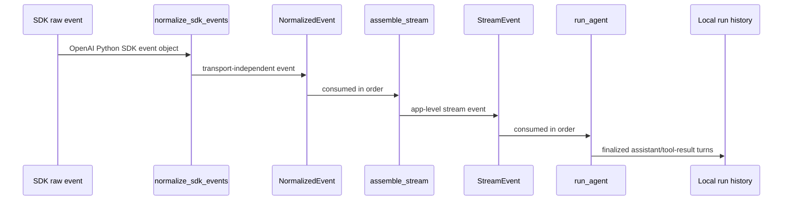
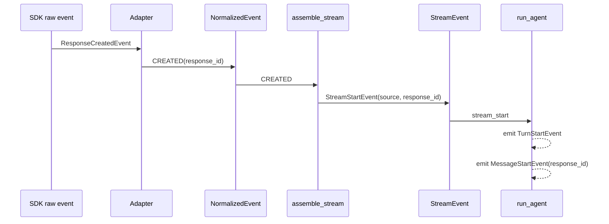
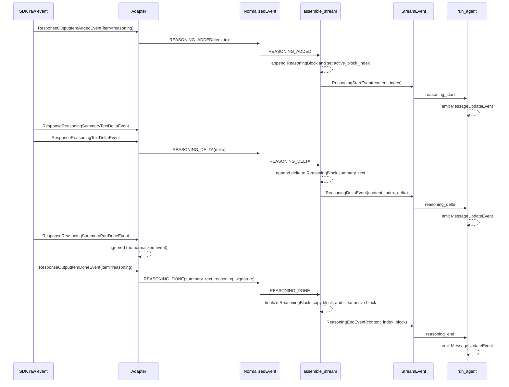
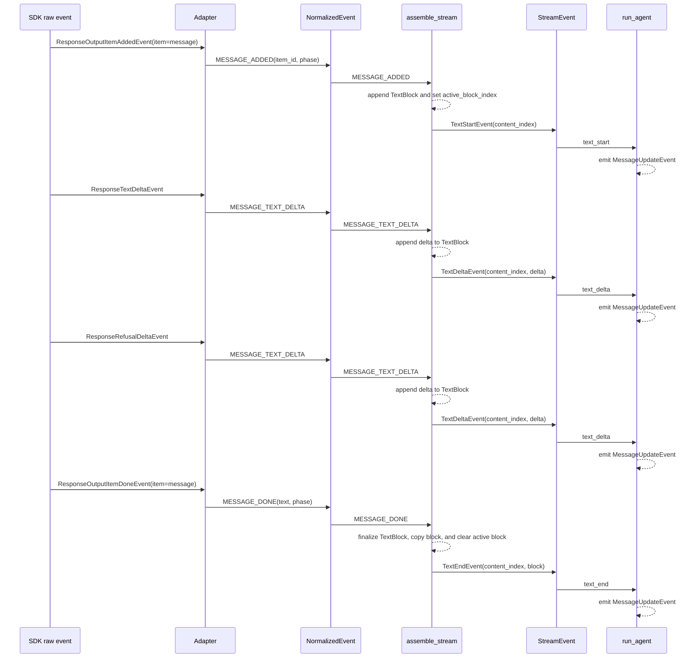
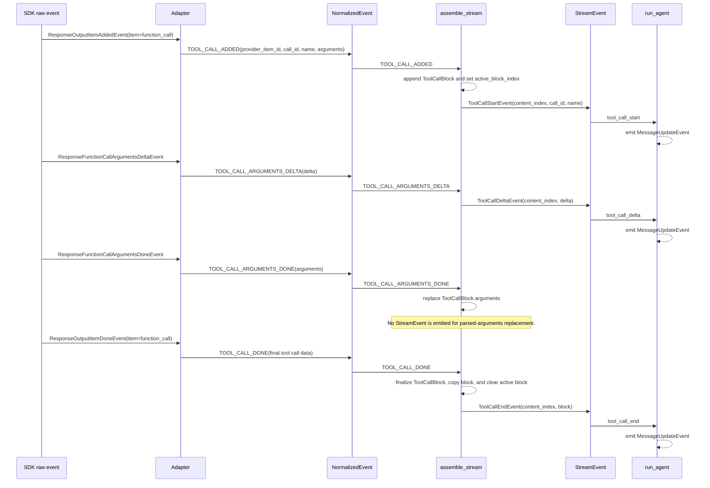
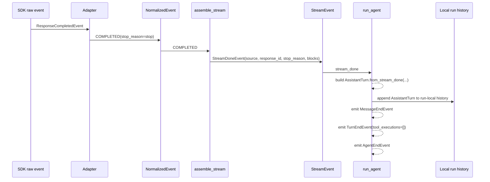
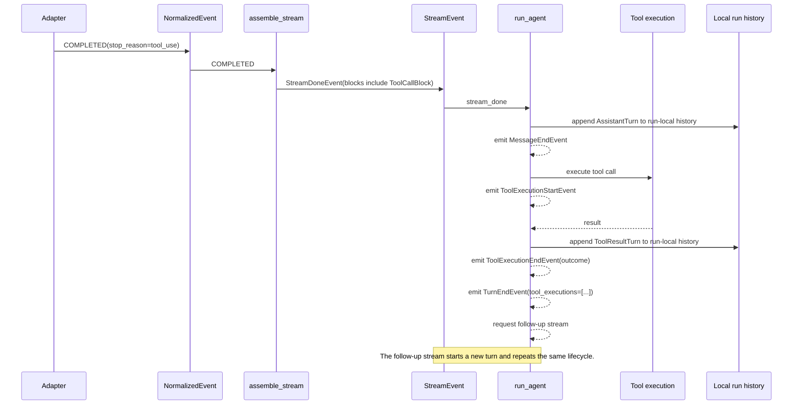
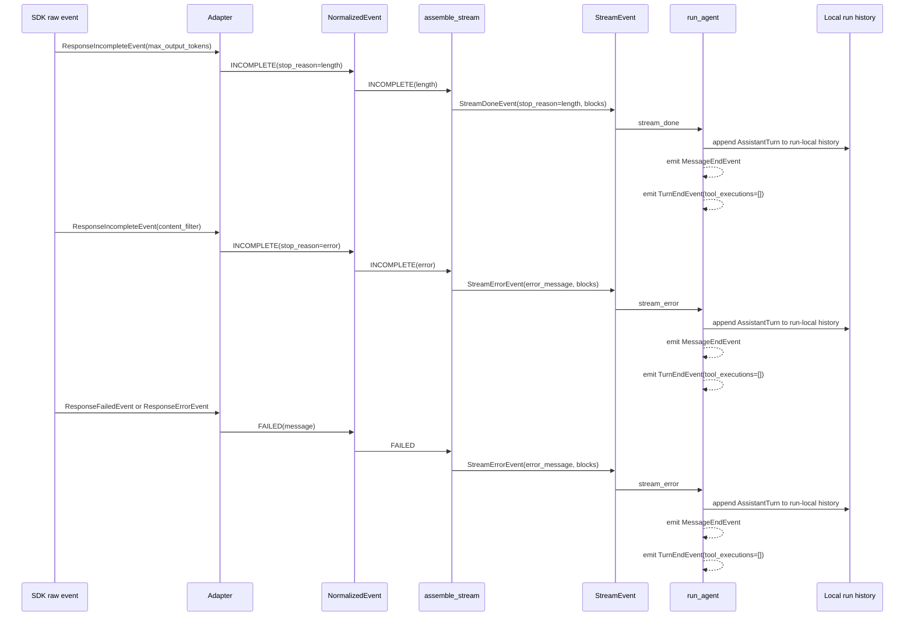

# OpenAI Stream Event Lifecycle

This document maps raw OpenAI stream events from the SDK transport to the final agent-facing events. The executable source of truth is still the test suite:

- `tests/test_openai_provider.py` covers raw SDK payloads through provider stream events.
- `tests/test_openai_stream_assembler.py` covers normalized events through provider stream events.
- `tests/test_agent.py` covers provider stream events through agent events.

The diagrams below use actor-style Mermaid sequence diagrams. Columns are stages in the pipeline, and time flows from top to bottom.

## Actors



## Stream Start And Created

`assemble_stream` emits `StreamStartEvent` when it consumes the provider `CREATED` event. The event carries the provider source and response id; assistant blocks are accumulated privately until terminal events.



## Reasoning Item

Reasoning summary deltas and reasoning text deltas both normalize to `REASONING_DELTA` and pass through verbatim. Summary part boundaries are not surfaced as deltas, so mid-stream delta text may lack the paragraph separators present in the final summary; `REASONING_DONE` joins parts with a blank line and is the authoritative text.



## Text And Refusal Item

Output-text and refusal deltas both normalize to `MESSAGE_TEXT_DELTA` and append to the active text block; the final `MESSAGE_DONE` text concatenates output-text and refusal parts.



## Tool Call Item

Argument deltas are emitted for streaming UI updates. Parsed arguments are stored on the tool-call block when the arguments-done or item-done events arrive.



## Completed Turn Without Tools



## Completed Turn With Tools



## Incomplete And Failed Turns



## Raw Event Mapping

| Raw SDK event | Normalized event | Stream assembler effect | Agent effect |
| --- | --- | --- | --- |
| `ResponseCreatedEvent` | `CREATED` | `StreamStartEvent` | `TurnStartEvent`, `MessageStartEvent(response_id)` |
| `ResponseOutputItemAddedEvent` with reasoning item | `REASONING_ADDED` | `ReasoningStartEvent` | `MessageUpdateEvent` |
| `ResponseReasoningSummaryTextDeltaEvent` | `REASONING_DELTA` | `ReasoningDeltaEvent` | `MessageUpdateEvent` |
| `ResponseReasoningTextDeltaEvent` | `REASONING_DELTA` | `ReasoningDeltaEvent` | `MessageUpdateEvent` |
| `ResponseReasoningSummaryPartDoneEvent` | ignored | — | — |
| `ResponseOutputItemDoneEvent` with reasoning item | `REASONING_DONE` | `ReasoningEndEvent` | `MessageUpdateEvent` |
| `ResponseOutputItemAddedEvent` with message item | `MESSAGE_ADDED` | Starts the text block | `TextStartEvent` |
| `ResponseTextDeltaEvent` | `MESSAGE_TEXT_DELTA` | `TextDeltaEvent` | `MessageUpdateEvent` |
| `ResponseRefusalDeltaEvent` | `MESSAGE_TEXT_DELTA` | `TextDeltaEvent` | `MessageUpdateEvent` |
| `ResponseOutputItemDoneEvent` with message item | `MESSAGE_DONE` | `TextEndEvent` | `MessageUpdateEvent` |
| `ResponseOutputItemAddedEvent` with function-call item | `TOOL_CALL_ADDED` | `ToolCallStartEvent` | `MessageUpdateEvent` |
| `ResponseFunctionCallArgumentsDeltaEvent` | `TOOL_CALL_ARGUMENTS_DELTA` | `ToolCallDeltaEvent` | `MessageUpdateEvent` |
| `ResponseFunctionCallArgumentsDoneEvent` | `TOOL_CALL_ARGUMENTS_DONE` | Replaces parsed arguments; no new stream event | No direct event |
| `ResponseOutputItemDoneEvent` with function-call item | `TOOL_CALL_DONE` | `ToolCallEndEvent` | `MessageUpdateEvent` |
| `ResponseCompletedEvent` | `COMPLETED` | `StreamDoneEvent` | `MessageEndEvent`, `TurnEndEvent`, optional tool execution |
| `ResponseIncompleteEvent` with length stop | `INCOMPLETE(length)` | `StreamDoneEvent` | `MessageEndEvent`, `TurnEndEvent` |
| `ResponseIncompleteEvent` with content-filter stop | `INCOMPLETE(error)` | `StreamErrorEvent` | `MessageEndEvent`, `TurnEndEvent` with error assistant turn |
| `ResponseFailedEvent` or `ResponseErrorEvent` | `FAILED` | `StreamErrorEvent` | `MessageEndEvent`, `TurnEndEvent` with error assistant turn |

## Run Lifecycle

Two events are guaranteed on every in-process termination path: every run
log begins with `RunStartEvent` and ends with exactly one
`RunEndEvent(outcome)`. Inner events are producer-emitted and carry no
such guarantee — a failure or abort can tear the run down with inner
scopes still open, so an inner start may lack its end. Consumers apply
one sweep rule: an end event ends anything still open inside its scope,
and the run end ends everything, with its outcome naming why exactly
once. Hard process death is outside this contract.

| Scope | Start | End |
| --- | --- | --- |
| run | `RunStartEvent` (guaranteed first) | `RunEndEvent(outcome)` (guaranteed last) |
| agent attempt | `AgentStartEvent` | `AgentEndEvent` |
| turn | `TurnStartEvent` | `TurnEndEvent(assistant_turn, tool_executions)` |
| message | `MessageStartEvent` | `MessageEndEvent(assistant_turn)` |
| tool execution | `ToolExecutionStartEvent(call_id)` | `ToolExecutionEndEvent(outcome)` |

Rules:

- The run publishes its own `RunStartEvent` before the event source
  starts, so every run log begins with a run start on every path,
  including an abort that lands before the first tick.
- `RunEndEvent` is the final event of every run, exactly once, and commits
  the run's terminal outcome — emitted by the producer on success,
  synthesized at finalization otherwise. Its outcome variant implies how
  execution terminated. The commit is structural: the run stops pumping
  its event source at the first run end and closes it, so nothing a
  producer yields afterwards can reach the log or rewrite the outcome.
- A tool execution that *fails* still gets its `ToolExecutionEndEvent`:
  the executor boundary wraps every tool failure into an error outcome.
  Only teardown — abort or a run failure while the tool is in flight —
  leaves a tool start without its end, and the run end follows it.
- An attempt whose turn errored in-band still ends normally with its
  producer events; the failure story lives on the errored assistant turn
  and the run end's outcome.
- Typed-result runs close each agent attempt before the follow-up message
  or next attempt starts; the final `AgentEndEvent` precedes `RunEndEvent`.
  Agent events carry no attempt label: attempts are strictly sequential,
  so position in the log identifies them, with `ResultFollowUpEvent`
  separating retries.
- Terminal record persistence happens after the run end is committed;
  `Run.wait()` returns only after finalization, so waiters always observe
  a closed log.
- Provider stream fragments (`TextStart/End`, `ReasoningStart/End`,
  `ToolCallStart/Delta/End`, and the provider `StreamStart/Done/Error`
  events) are message content, not lifecycle scopes; the containing
  message's end, or the sweep, terminates their outstanding state.
- A producer that completes without committing a run end fails the run
  with an explicit "ended without a committed run end event" execution
  failure.

Abort ordering during a tool call — the open scopes are simply left open
and the run end sweeps them:

```text
...
MessageEnd(assistant_turn)
ToolExecutionStart(call_id)
RunEnd(outcome=Aborted)
```

Typed-result follow-up ordering:

```text
RunStart
  AgentStart
    ...
  AgentEnd
  ResultFollowUp
  AgentStart
    ...
  AgentEnd
RunEnd(outcome)
```
