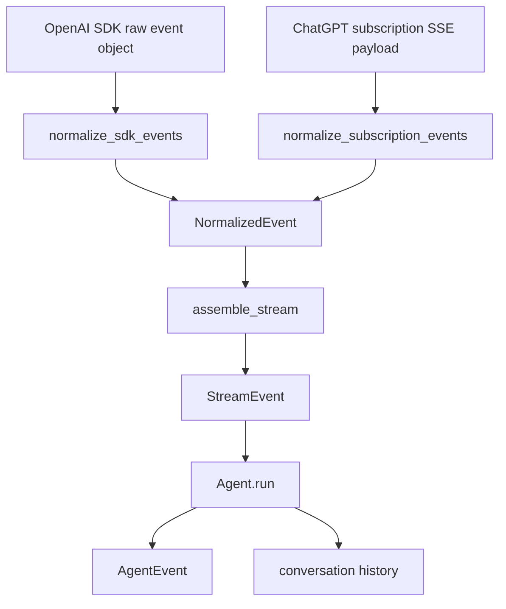
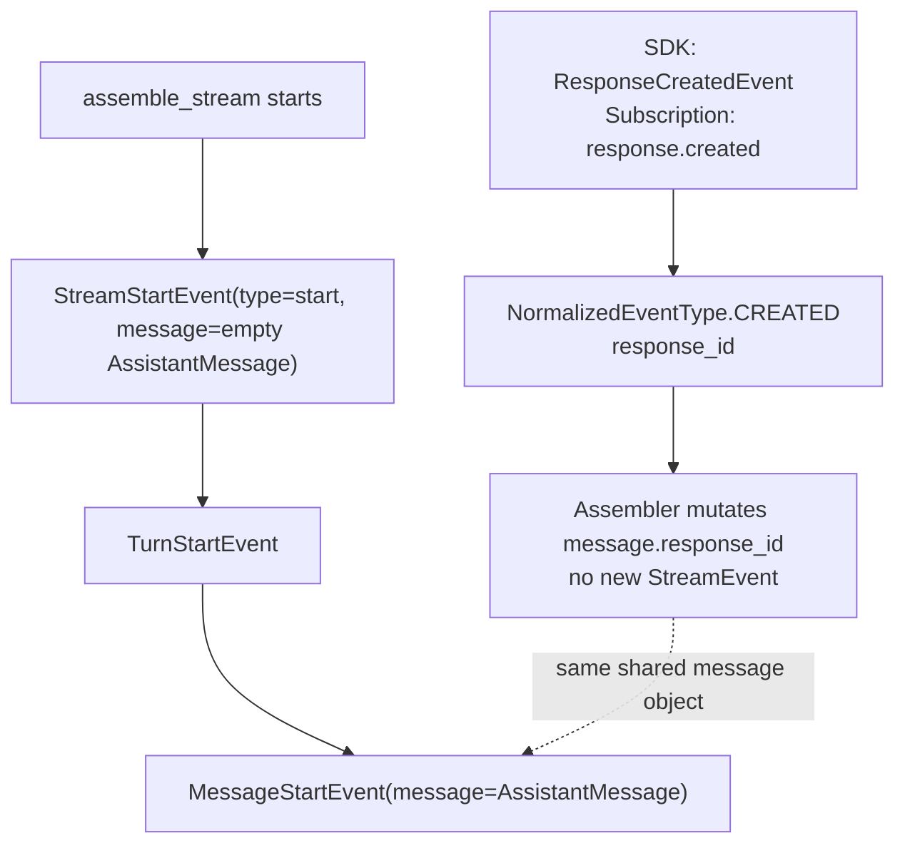
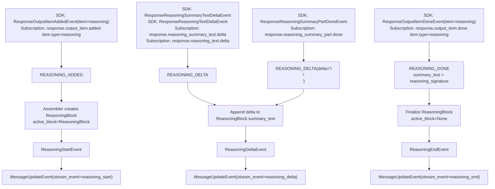
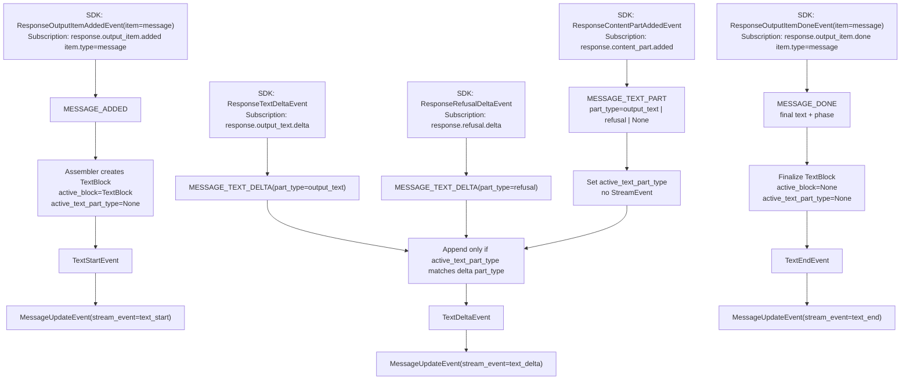
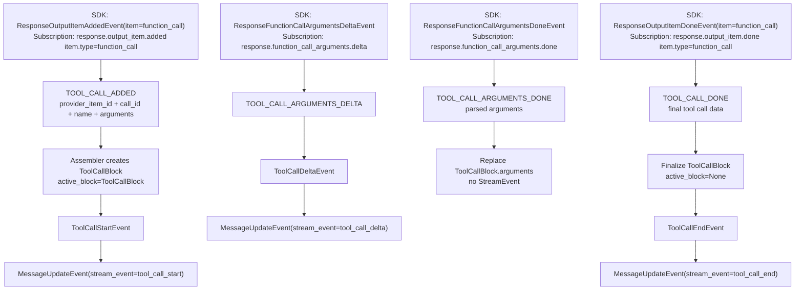
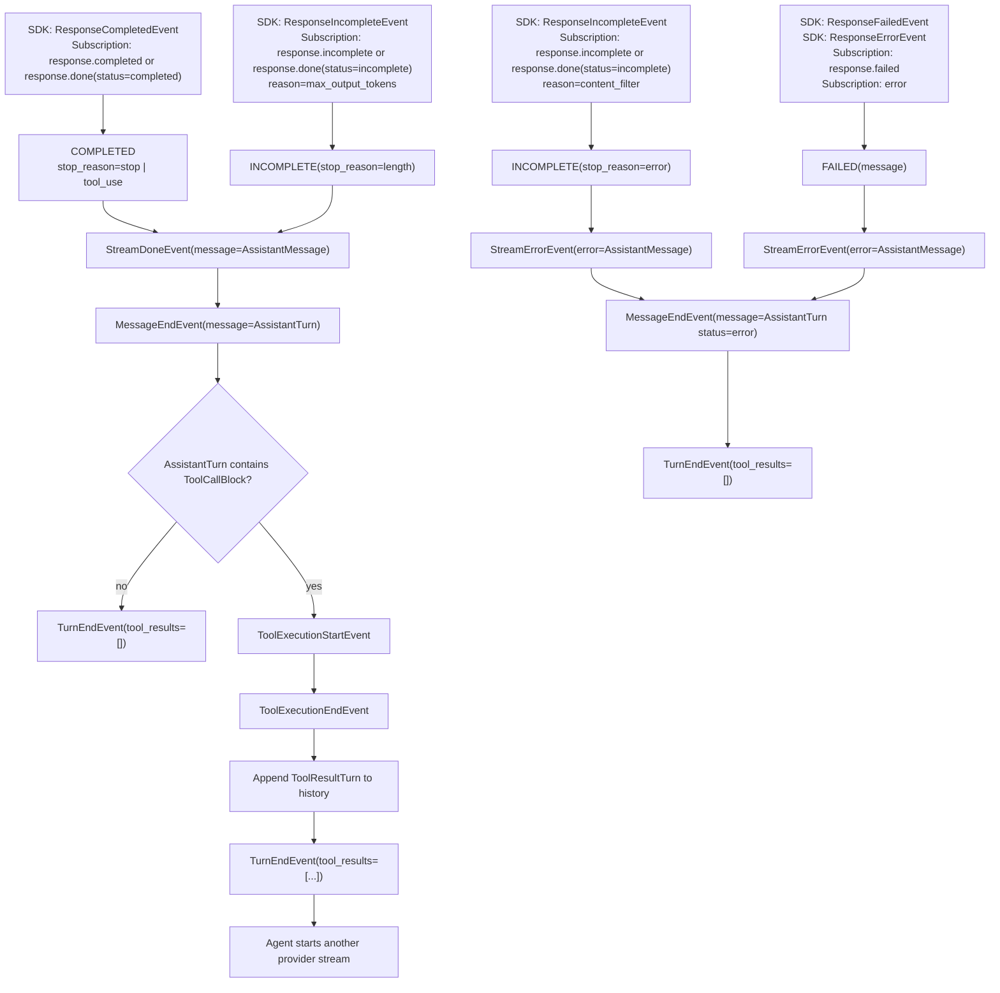

# OpenAI Stream Event Lifecycle

This document maps raw OpenAI stream events from both supported transports to the final agent-facing events. The executable source of truth is still the test suite:

- `tests/test_openai_provider.py` covers raw SDK and subscription payloads through provider stream events.
- `tests/test_openai_stream_assembler.py` covers normalized events through app stream events.
- `tests/test_agent.py` covers app stream events through agent events.

## Pipeline

`assemble_stream` emits `StreamStartEvent` before consuming the first normalized event. Later `CREATED` events mutate that same shared assistant message with the provider response id.

## Response Start

## Reasoning Events

## Text And Refusal Events

Unsupported content parts normalize to `MESSAGE_TEXT_PART(part_type=None)`. That clears text accumulation until another supported `output_text` or `refusal` part becomes active.

## Tool Call Events

`ToolCallDeltaEvent` reports the raw argument delta for UI streaming. Parsed arguments are stored on the `ToolCallBlock` when `TOOL_CALL_ARGUMENTS_DONE` or `TOOL_CALL_DONE` arrives.

## Terminal Events And Agent Finalization

The agent appends the finalized assistant turn to history on `StreamDoneEvent` and `StreamErrorEvent`. If the completed assistant turn contains tool calls, the agent executes tools, appends tool-result turns, ends the current turn, and then requests a follow-up assistant stream.

## Raw Event Mapping

| Raw SDK event | Raw subscription event | Normalized event | Stream assembler effect | Agent effect |
| --- | --- | --- | --- | --- |
| `ResponseCreatedEvent` | `response.created` | `CREATED` | Mutates `message.response_id`; no new stream event | Shared message already referenced by `MessageStartEvent` |
| `ResponseOutputItemAddedEvent` with reasoning item | `response.output_item.added` with `item.type=reasoning` | `REASONING_ADDED` | `ReasoningStartEvent` | `MessageUpdateEvent` |
| `ResponseReasoningSummaryTextDeltaEvent` | `response.reasoning_summary_text.delta` | `REASONING_DELTA` | `ReasoningDeltaEvent` | `MessageUpdateEvent` |
| `ResponseReasoningTextDeltaEvent` | `response.reasoning_text.delta` | `REASONING_DELTA` | `ReasoningDeltaEvent` | `MessageUpdateEvent` |
| `ResponseReasoningSummaryPartDoneEvent` | `response.reasoning_summary_part.done` | `REASONING_DELTA` with paragraph separator | `ReasoningDeltaEvent` | `MessageUpdateEvent` |
| `ResponseOutputItemDoneEvent` with reasoning item | `response.output_item.done` with `item.type=reasoning` | `REASONING_DONE` | `ReasoningEndEvent` | `MessageUpdateEvent` |
| `ResponseOutputItemAddedEvent` with message item | `response.output_item.added` with `item.type=message` | `MESSAGE_ADDED` | `TextStartEvent` | `MessageUpdateEvent` |
| `ResponseContentPartAddedEvent` | `response.content_part.added` | `MESSAGE_TEXT_PART` | Sets active text part; no new stream event | No direct event |
| `ResponseTextDeltaEvent` | `response.output_text.delta` | `MESSAGE_TEXT_DELTA(output_text)` | `TextDeltaEvent` if output text is active | `MessageUpdateEvent` |
| `ResponseRefusalDeltaEvent` | `response.refusal.delta` | `MESSAGE_TEXT_DELTA(refusal)` | `TextDeltaEvent` if refusal is active | `MessageUpdateEvent` |
| `ResponseOutputItemDoneEvent` with message item | `response.output_item.done` with `item.type=message` | `MESSAGE_DONE` | `TextEndEvent` | `MessageUpdateEvent` |
| `ResponseOutputItemAddedEvent` with function-call item | `response.output_item.added` with `item.type=function_call` | `TOOL_CALL_ADDED` | `ToolCallStartEvent` | `MessageUpdateEvent` |
| `ResponseFunctionCallArgumentsDeltaEvent` | `response.function_call_arguments.delta` | `TOOL_CALL_ARGUMENTS_DELTA` | `ToolCallDeltaEvent` | `MessageUpdateEvent` |
| `ResponseFunctionCallArgumentsDoneEvent` | `response.function_call_arguments.done` | `TOOL_CALL_ARGUMENTS_DONE` | Replaces parsed arguments; no new stream event | No direct event |
| `ResponseOutputItemDoneEvent` with function-call item | `response.output_item.done` with `item.type=function_call` | `TOOL_CALL_DONE` | `ToolCallEndEvent` | `MessageUpdateEvent` |
| `ResponseCompletedEvent` | `response.completed` or completed `response.done` | `COMPLETED` | `StreamDoneEvent` | `MessageEndEvent`, `TurnEndEvent`, optional tool execution |
| `ResponseIncompleteEvent` with length stop | `response.incomplete` or incomplete `response.done` | `INCOMPLETE(length)` | `StreamDoneEvent` | `MessageEndEvent`, `TurnEndEvent` |
| `ResponseIncompleteEvent` with content-filter stop | `response.incomplete` or incomplete `response.done` | `INCOMPLETE(error)` | `StreamErrorEvent` | `MessageEndEvent`, `TurnEndEvent` with error assistant turn |
| `ResponseFailedEvent` or `ResponseErrorEvent` | `response.failed` or `error` | `FAILED` | `StreamErrorEvent` | `MessageEndEvent`, `TurnEndEvent` with error assistant turn |
